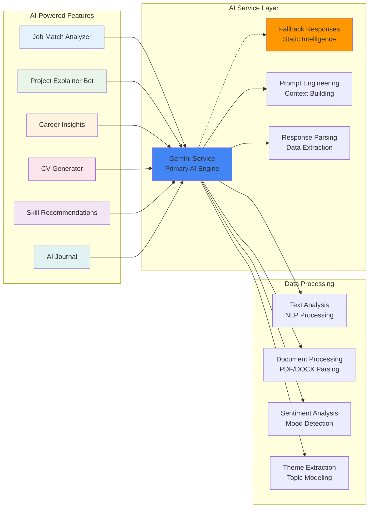
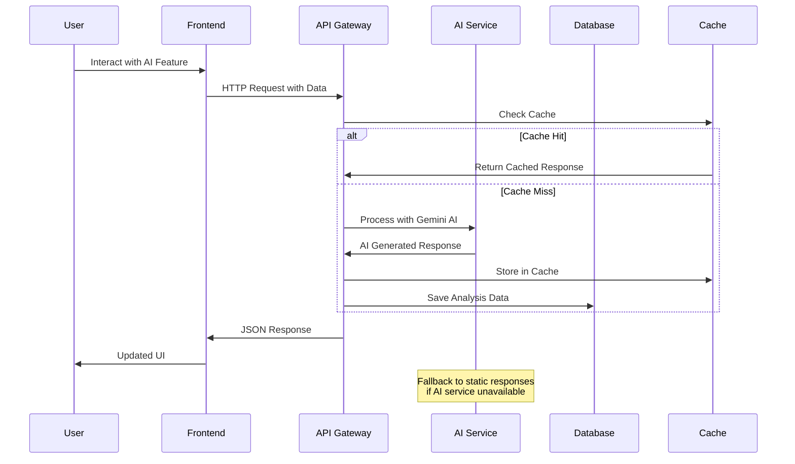
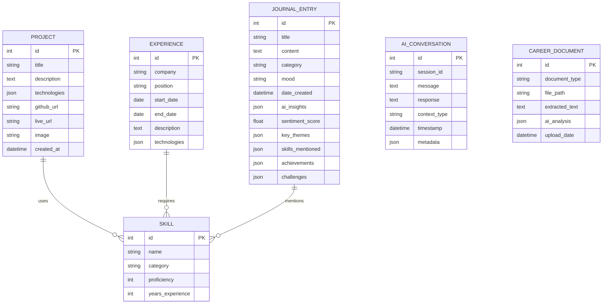
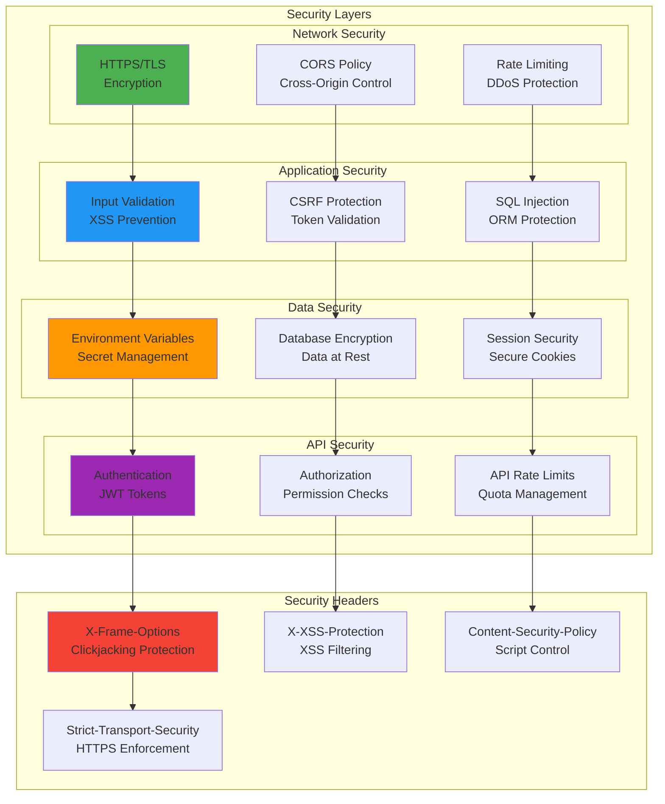
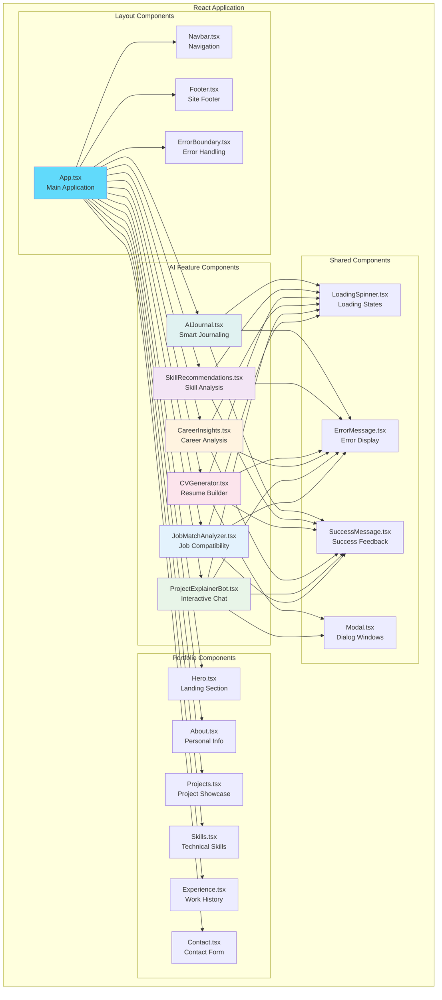

```mermaid
graph TB
    subgraph "Production Environment"
        subgraph "Load Balancer"
            LB[Nginx<br/>Reverse Proxy]
        end
        
        subgraph "Application Layer"
            FE1[Frontend Container 1<br/>React + Nginx]
            FE2[Frontend Container 2<br/>React + Nginx]
            BE1[Backend Container 1<br/>Django + Gunicorn]
            BE2[Backend Container 2<br/>Django + Gunicorn]
        end
        
        subgraph "Data Layer"
            DB[(PostgreSQL<br/>Primary Database)]
            REDIS[(Redis<br/>Cache & Sessions)]
            FILES[File Storage<br/>Media & Static]
        end
        
        subgraph "External Services"
            AI[Google Gemini AI]
            EMAIL[Email Service]
            MONITOR[Health Monitoring]
        end
    end
    
    LB --> FE1
    LB --> FE2
    LB --> BE1
    LB --> BE2
    
    BE1 --> DB
    BE2 --> DB
    BE1 --> REDIS
    BE2 --> REDIS
    BE1 --> FILES
    BE2 --> FILES
    
    BE1 --> AI
    BE2 --> AI
    BE1 --> EMAIL
    BE2 --> EMAIL
    
    MONITOR --> BE1
    MONITOR --> BE2
    MONITOR --> DB
    MONITOR --> REDIS
    
    style LB fill:#ff9800
    style FE1 fill:#61dafb
    style FE2 fill:#61dafb
    style BE1 fill:#092e20
    style BE2 fill:#092e20
    style DB fill:#336791
    style REDIS fill:#dc382d
    style AI fill:#4285f4
```

```mermaid
graph TB
    subgraph "Frontend Monitoring"
        A[Page Load Times<br/>Core Web Vitals]
        B[JavaScript Errors<br/>Error Tracking]
        C[User Interactions<br/>Analytics]
        D[Bundle Size<br/>Performance Budget]
    end
    
    subgraph "Backend Monitoring"
        E[API Response Times<br/>Endpoint Performance]
        F[Database Queries<br/>Query Optimization]
        G[Memory Usage<br/>Resource Monitoring]
        H[Error Rates<br/>Exception Tracking]
    end
    
    subgraph "AI Service Monitoring"
        I[AI Response Times<br/>Latency Tracking]
        J[API Quota Usage<br/>Rate Limit Monitoring]
        K[Fallback Triggers<br/>Reliability Metrics]
        L[Success Rates<br/>Quality Metrics]
    end
    
    subgraph "Infrastructure Monitoring"
        M[Server Health<br/>System Metrics]
        N[Database Performance<br/>Connection Pools]
        O[Cache Hit Rates<br/>Redis Metrics]
        P[Network Latency<br/>CDN Performance]
    end
    
    subgraph "Alerting System"
        Q[Threshold Alerts<br/>Performance Degradation]
        R[Error Alerts<br/>Critical Issues]
        S[Capacity Alerts<br/>Resource Limits]
        T[Security Alerts<br/>Suspicious Activity]
    end
    
    A --> Q
    B --> R
    C --> Q
    D --> Q
    E --> Q
    F --> R
    G --> S
    H --> R
    I --> Q
    J --> S
    K --> R
    L --> Q
    M --> S
    N --> R
    O --> Q
    P --> Q
    
    Q --> T
    R --> T
    S --> T
    
    style A fill:#61dafb
    style E fill:#092e20
    style I fill:#4285f4
    style M fill:#ff9800
    style Q fill:#f44336
```

# 🏗️ AI-Enhanced Portfolio - Architecture Diagrams

## 📊 System Architecture Overview

```mermaid
graph TB
    subgraph "Frontend Layer"
        A[React App<br/>TypeScript + Vite]
        B[UI Components<br/>Tailwind CSS]
        C[State Management<br/>React Hooks]
        D[API Client<br/>Axios]
    end
    
    subgraph "Backend Layer"
        E[Django REST API<br/>Python 3.12]
        F[AI Services<br/>Gemini Integration]
        G[Data Models<br/>Django ORM]
        H[Background Tasks<br/>Celery]
    end
    
    subgraph "Data Layer"
        I[PostgreSQL<br/>Production DB]
        J[SQLite<br/>Development DB]
        K[Redis<br/>Cache & Sessions]
        L[File Storage<br/>Media Files]
    end
    
    subgraph "External Services"
        M[Google Gemini AI<br/>Text Generation]
        N[Email Service<br/>SMTP]
        O[Cloud Storage<br/>Static Files]
    end
    
    A --> B
    B --> C
    C --> D
    D --> E
    E --> F
    E --> G
    E --> H
    G --> I
    G --> J
    E --> K
    E --> L
    F --> M
    E --> N
    A --> O
    
    style A fill:#61dafb
    style E fill:#092e20
    style M fill:#4285f4
    style I fill:#336791
```

## 🤖 AI Features Architecture

## 🔄 Data Flow Architecture

## 🗄️ Database Schema

## 🚀 Deployment Architecture

## 🔒 Security Architecture

## 📱 Component Architecture

## 🔄 CI/CD Pipeline

```mermaid
graph LR
    subgraph "Development"
        A[Local Development<br/>Git Commits]
        B[Feature Branch<br/>Pull Request]
        C[Code Review<br/>Approval]
    end
    
    subgraph "CI Pipeline"
        D[GitHub Actions<br/>Trigger]
        E[Install Dependencies<br/>uv & npm]
        F[Run Tests<br/>Backend & Frontend]
        G[Security Scan<br/>Vulnerability Check]
        H[Build Images<br/>Docker Build]
    end
    
    subgraph "CD Pipeline"
        I[Push to Registry<br/>Container Registry]
        J[Deploy to Staging<br/>Test Environment]
        K[Integration Tests<br/>E2E Testing]
        L[Deploy to Production<br/>Blue-Green Deploy]
    end
    
    subgraph "Monitoring"
        M[Health Checks<br/>Service Monitoring]
        N[Performance Metrics<br/>Response Times]
        O[Error Tracking<br/>Log Analysis]
        P[Alerts<br/>Incident Response]
    end
    
    A --> B
    B --> C
    C --> D
    D --> E
    E --> F
    F --> G
    G --> H
    H --> I
    I --> J
    J --> K
    K --> L
    L --> M
    M --> N
    N --> O
    O --> P
    
    style D fill:#2196f3
    style H fill:#ff9800
    style L fill:#4caf50
    style P fill:#f44336
```

## 📊 Performance Monitoring

---

## 🎯 Architecture Benefits

### 🔧 **Scalability**
- **Microservices Ready**: Modular architecture allows easy service separation
- **Horizontal Scaling**: Load balancer distributes traffic across multiple instances
- **Database Optimization**: Efficient queries and caching reduce database load
- **CDN Integration**: Static assets served from edge locations

### 🛡️ **Security**
- **Defense in Depth**: Multiple security layers protect against various threats
- **Zero Trust**: Every request validated and authorized
- **Data Protection**: Encryption at rest and in transit
- **Secure Development**: Security built into the development process

### ⚡ **Performance**
- **Caching Strategy**: Multi-level caching reduces response times
- **Lazy Loading**: Components loaded on demand
- **Database Optimization**: Indexes and query optimization
- **AI Response Caching**: Reduces AI API calls and improves speed

### 🔄 **Maintainability**
- **Clean Architecture**: Separation of concerns and modular design
- **Type Safety**: TypeScript prevents runtime errors
- **Comprehensive Testing**: Unit, integration, and E2E tests
- **Documentation**: Detailed technical and user documentation

### 🚀 **Deployment**
- **Containerization**: Consistent environments across development and production
- **Infrastructure as Code**: Reproducible deployments
- **Blue-Green Deployment**: Zero-downtime updates
- **Health Monitoring**: Proactive issue detection and resolution

---

**🏗️ This architecture demonstrates enterprise-level system design capabilities while maintaining simplicity and developer experience!**
